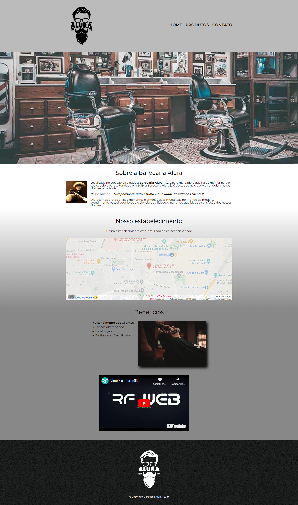

<h1> Curso de Front-End - Alura </h1>

  Projeto desenvolvido desenvolvido durante o decorrer do meu primeiro curso de HTML5 e CSS3, a pagina e simples e compriu bem seu papel durante o curso conhecer e treinar HTML e CSS.

 

  

## 🚀 Tecnologias

Esse projeto foi desenvolvido com as seguintes tecnologias:

- <strong>
     
      HTML
  </strong>
- <strong>
     
      CSS
  </strong>

## 💻 Projeto

- Aprenda o que é o HTML e o CSS.
- Entenda a estrutura básica de um arquivo HTML
- Utilize o navegador para inspecionar elementos
- Aprenda a definir estilos para elementos usando o CSS
- Desenvolva um página Web
- Navegue entre páginas web
- Conheça reset.css e o posicionamento pelo CSS
- Entenda a diferença entre inline e block
- Lide com bordas e pseudo-classes CSS
- Crie formulários complexos
- Trabalhe com campos para celulares
- Apresente informações em tabelas
- Use estilos para formulários, campos e tabelas
- Entenda a hierarquia no CSS
- Trabalhe com transformações e transições
- Importe conteúdo externo na sua página HTML, como fontes, - - Vídeos e mapas
- Conheça pseudo-classes e pseudo-elementos
- Use seletores de CSS avançados
- Saiba como lidar com opacidade e sombra
- Entenda sobre o Viewport e design responsivo
